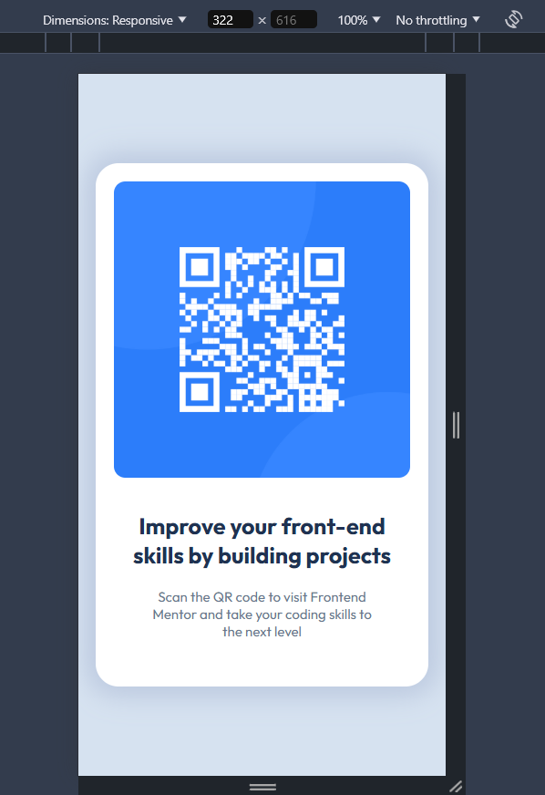
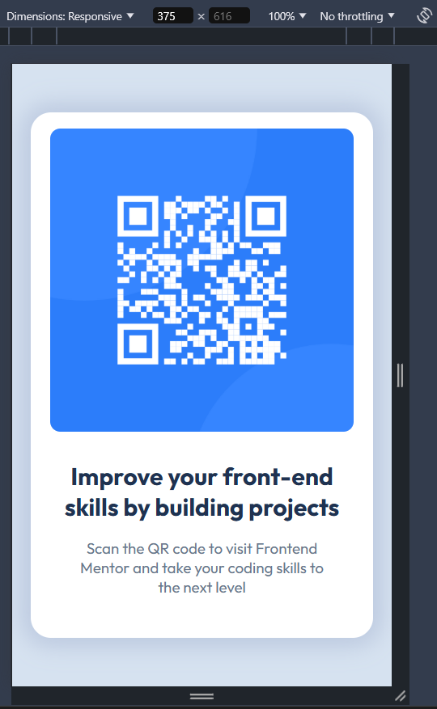
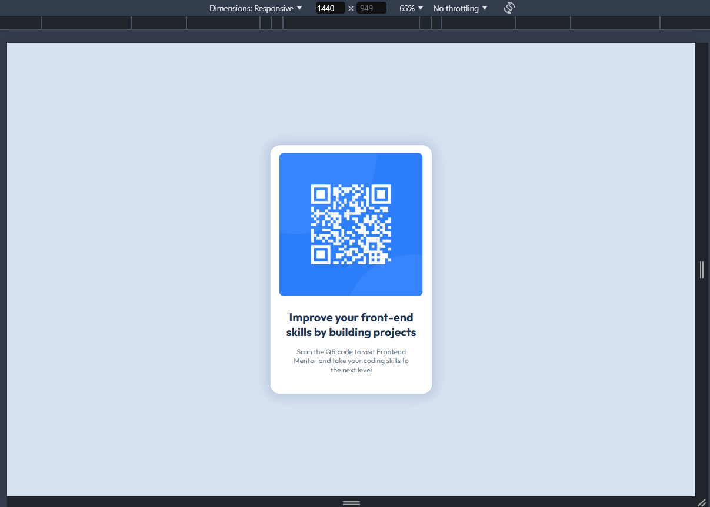
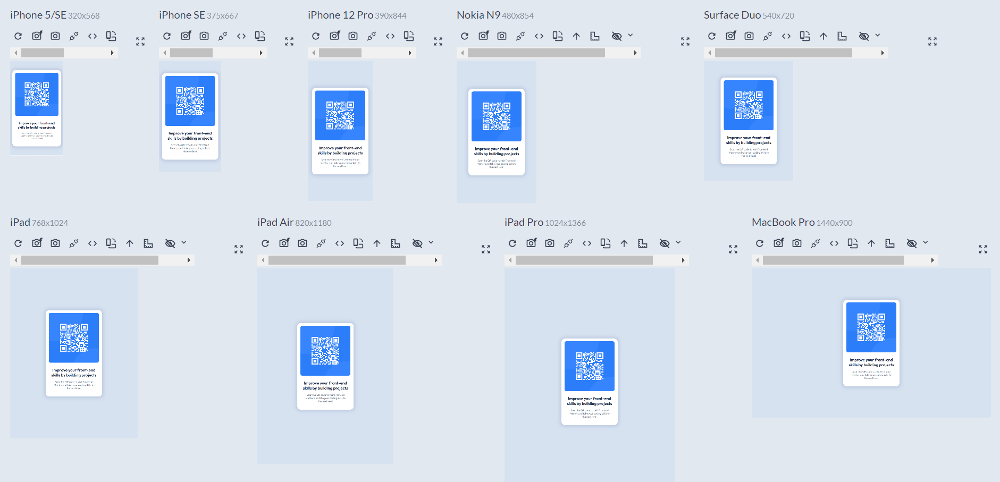

# Frontend Mentor - QR code component solution

This is a solution to the [QR code component challenge on Frontend Mentor](https://www.frontendmentor.io/challenges/qr-code-component-iux_sIO_H). Frontend Mentor challenges help you improve your coding skills by building realistic projects.

## Table of contents

- [Overview](#overview)
  - [Screenshot](#screenshot)
  - [Links](#links)
- [My process](#my-process)
  - [Built with](#built-with)
  - [What I learned](#what-i-learned)
  - [Continued development](#continued-development)
  - [Useful resources](#useful-resources)
- [Author](#author)
- [Acknowledgments](#acknowledgments)

**Note: Delete this note and update the table of contents based on what sections you keep.**

## Overview

### Screenshot

### Links

- Solution URL: [Add solution URL here](https://your-solution-url.com)
- Live Site URL: [Add live site URL here](https://jolly-cajeta-545747.netlify.app/)

## My process

### Built with

- Semantic HTML5 markup
- Flexbox
- Responsive Design Approach

### What I learned

1. I learn about semantics of HTML 5
2. Responsive Design
3. Learn about monorepo
4. How to deploy project to netlify

### Continued development

Build with mobile first, using react, and challenge my self to finish it only for 15 minutes.

### Useful resources

- [Example resource 1](https://www.example.com) - This helped me for XYZ reason. I really liked this pattern and will use it going forward.
- [Example resource 2](https://www.example.com)

## Author

- Frontend Mentor - [@@agilhz](https://www.frontendmentor.io/profile/yourusername)
- Twitter - [@agil_hz](https://x.com/agil_hz)
- Instagram - [@agil_haubi_zikri](https://www.instagram.com/agil_haubi_zikri/)

## Acknowledgments

Credit for [Web Programming UNPAS](https://www.youtube.com/c/WebProgrammingUNPAS), [Dicoding](https://www.dicoding.com/), and [W3schools.com](https://www.w3schools.com/) that teach me about HTML 5 and CSS 3.
